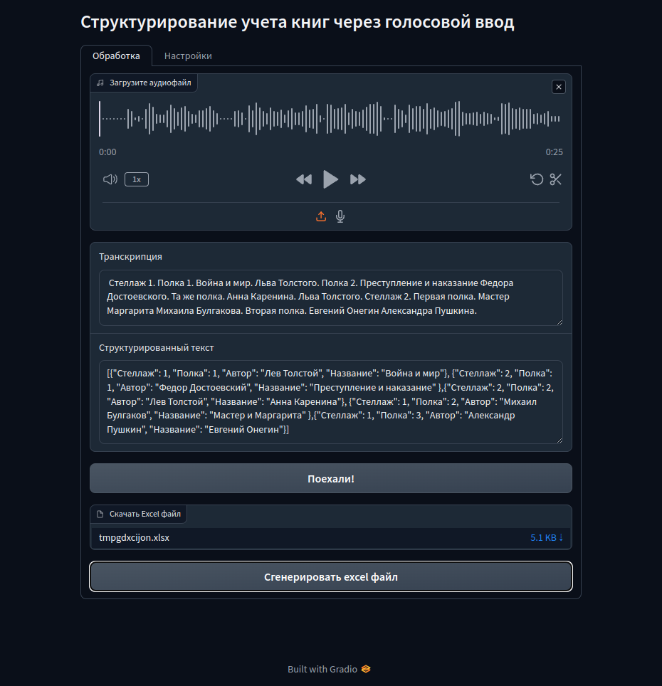
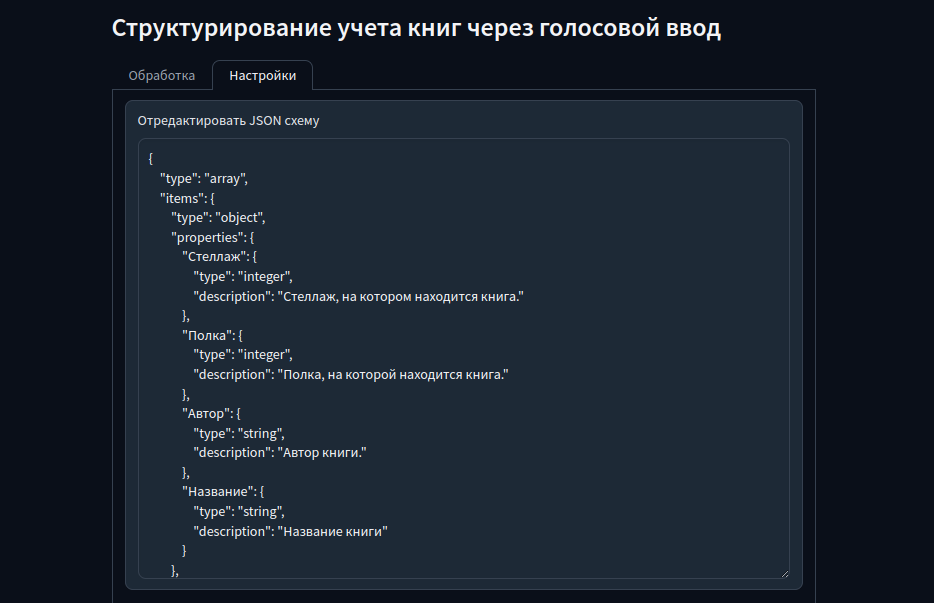
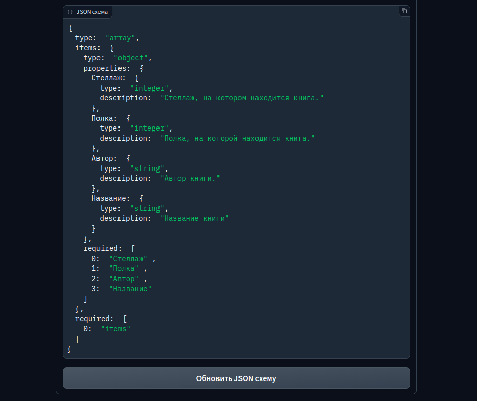

# bookshelves

  

 

# Описание

Это проект, который позволяет структурировать учет книг через голосовой ввод. Проект включает несколько ключевых компонентов: веб-приложение на базе Gradio, модули для распознавания речи и генерации текста, а также инструмент для конвертации JSON в Excel.

Вкладка "Обработка": здесь пользователь может загрузить аудиофайл, получить его транскрипцию и структурированный текст, а также сгенерировать файл Excel.

<a target="_blank" style="border-radius:10px; display: block; text-align: center;">
  
</a>

Вкладка "Настройки": позволяет редактировать JSON схему, используемую для структурирования данных.

<a target="_blank" style="border-radius:10px; display: block; text-align: center;">
  
</a>

<a target="_blank" style="border-radius:10px; display: block; text-align: center;">
  
</a>

## Пример использования приложения
- Пользователь загружает аудиофайл во вкладке "Обработка".
- Нажимает кнопку "Поехали!", чтобы получить транскрипцию и структурированный текст.
- После этого пользователь может нажать кнопку "Сгенерировать excel файл" для создания и скачивания файла Excel с данными.
- Во вкладке "Настройки" можно отредактировать JSON схему, чтобы изменить формат структурирования данных.

# Установка 


Для установки и запуска данного проекта, выполните следующие шаги:

1. **Клонируйте репозиторий:**

   ```bash
   git clone https://github.com/dimkablin/bookshelves.git
   cd bookshelves
   ```

2. **Создайте виртуальное окружение:**

   ```bash
   python3 -m venv venv
   source venv/bin/activate  
   ```

3. **Установите зависимости:**

   ```bash
   pip install -r requirements.txt
   ```

4. **Запустите приложение:**

   ```bash
   python3 src/main.py
   ```

5. **Откройте приложение в браузере:**

   Приложение будет доступно по адресу `http://127.0.0.1:8000`.

### Зависимости

Для работы приложения необходимы следующие зависимости, которые будут установлены из файла `requirements.txt`:

- `gradio`
- `openpyxl`
- `faster_whisper`
- `llama_cpp`

### Дополнительные настройки

Если вам нужно настроить JSON схему или другие параметры, вы можете отредактировать файл `env.py` или соответствующие переменные в коде.
